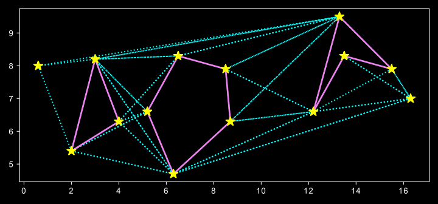

The Rotational Plane Sweep algorithm [PRS] 
 
implementation of graph visibility algorithms to visualize all the possible paths for a robot to move from a start to the goal position, in a 2D environment that contains a number polygon shaped obstacles. Both brute force and RPS techniques were implemented in different maps

to test their accuracy; visually and analytically.  next figures shows results of RPS on different environments

 

