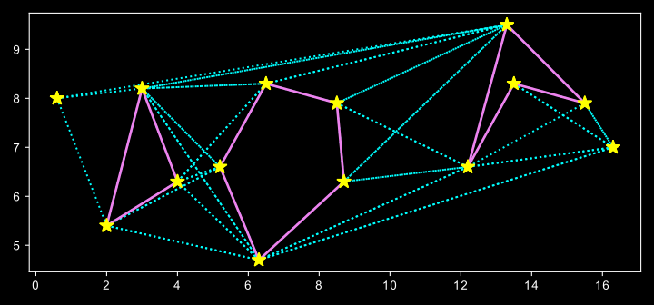

The Rotational Plane Sweep algorithm [PRS] 
 
implementation of graph visibility algorithms to visualize all the possible paths for a robot to move from a start to the goal position, in a 2D environment that contains a number polygon shaped obstacles. Both brute force and RPS techniques were implemented in different maps

to test their accuracy; visually and analytically.  next figures shows results of RPS on different environments

 

Path Planning

A path planning algorithm was implemented some path planning algorithm just for enter- tainment purposes. The set of nodes were arranged in the visibility graph, as keys of a python dictionary, with each connected vertex as the value of that node.

Breath-First-Search was re-used. because its implementation was available from a previous undergraduate project, just to check if it works. The results are shown in Figure 2.

Figure 2: BFS Path Planning on RPS VG
